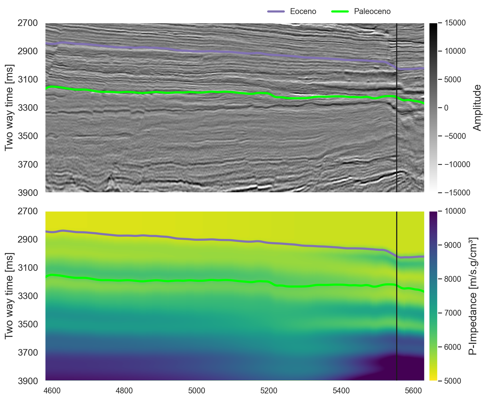
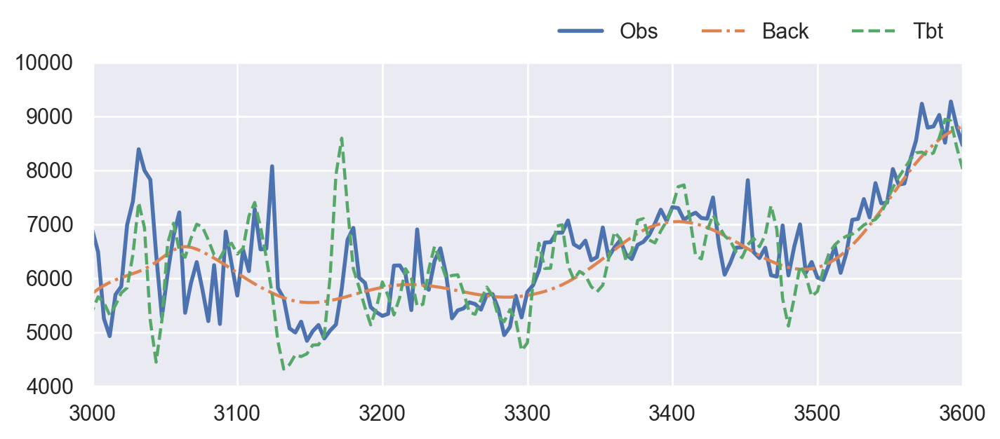

# Inversão Determinística - Parque das Baleias
Repository for comparing different inversion methods at a section at the Parque das Baleias

# 1 - Método dos Mínimos Quadrados

O primeiro método utilizado para inversão é o Método dos Mínimos Quadrados, das equações normais, que é implementado pela seguinte função:

`pylops.optimization.leastsquares.normal_equations_inversion`

Que é uma implementação das equações normais:

$$ m = (G^{T}G)^{-1}G^{T}y $$

Esse método implementa os sistemas de equação de forma explícita, e resolve eles usando um esquema iterativo útil para matrizes quadradas. 

# Situação inicial

# Resultado final
Seção

Plot de comparação

O código rodou em 9.63s

# 2 - Método dos Mínimos Quadrados