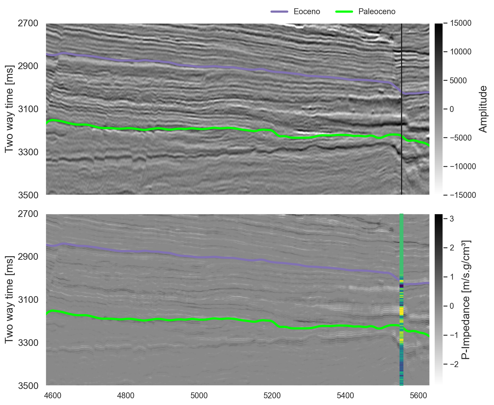

# Inversão Determinística - Parque das Baleias
Repository for comparing different inversion methods at a section at the Parque das Baleias

# 1 - Método dos Mínimos Quadrados

O primeiro método utilizado para inversão é o Método dos Mínimos Quadrados, das equações normais, que é implementado pela seguinte função:
<center>

`pylops.optimization.leastsquares.normal_equations_inversion`

</center>

Que é uma implementação das equações normais:

$$ m = (G^{T}G)^{-1}G^{T}y $$

Esse método implementa os sistemas de equação de forma explícita, e resolve eles usando um esquema iterativo útil para matrizes quadradas.
<center>
# Situação inicial


# Resultado final

Seção


Plot de comparação


O código rodou em 8.28s
</center>

# 2 - Mínimos Quadrados com Regularização

O método de regularização empregado usa o operador da segunda derivada, conforme expresso pela fórmula:

$$ x = (\textbf{R}^{T}\textbf{R} + \epsilon^{2}_{\nabla} \nabla^{T}\nabla)^{-1}\textbf{R}^{T}y $$

Essa abordagem é implementada por meio da classe `pylops.SecondDerivative`

A função utilizada, `pylops.optimization.leastsquares.regularized_inversion`, resolve o seguinte problema:

$$ \begin{split}\begin{bmatrix}
    \mathbf{R}    \\
    \epsilon_\nabla \nabla
\end{bmatrix} \mathbf{x} =
    \begin{bmatrix}
    \mathbf{y}    \\
    0
\end{bmatrix}\end{split} $$

```python
D2op = pylops.SecondDerivative([nz, nx], axis=1, dtype='float64')

# Regularized function
m_inv_reg, _, _, _, _ = pylops.optimization.leastsquares.regularized_inversion(
    Op=PPop, # operador de modelagem direta (G)
    y = amp_ls.ravel()/30000, # dado observado.
    Regs=[D2op], # regularization operator
    x0 = mback_ls.ravel(), # modelo inicial
    **dict(damp=9e-1, iter_lim=1000, show=0))

m_inv_reg = np.exp(m_inv_reg.reshape(nz, nx))
```
Nota: O mesmo resultado pode ser alcançado utilizando a `pylops.optimization.leastsquares.normal_equations_inversion`

Os parâmetros utilizados para o damping, que seria o Tikhonov damping é de 0.9, o que faz com que o modelo seja o mais próximo do módelo observado.

O resultado é o seguinte:

<center>


</center>

Como se pode observar, o resultado está mais suavizado que o sem a regularização. Isso se dá pelo valor do damping, que é mais alto que o utilizado no método anterior. Quanto mais alto esse valor, mais suavizado o resultado.

O código rodou em 8.86s

# 2 - Método FISTA

Esse método utiliza da Transformada de Fourier para resolver o problema de inversão. A função utilizada é a `pylops.optimization.leastsquares.fista`, e o erro utilizado é de 0.028.

```python
m_inv_fista = pylops.optimization.sparsity.fista(
    PPop,
    y = amp_ls.ravel()/30000,
    x0 = mback_ls.ravel(),
    niter=1000,
    eps=0.028,
    tol=1e-5
    )[0]

m_inv_fista = np.exp(mback_ls + m_inv_fista.reshape(nz, nx))
```
O resultado é o seguinte:

<center>

</center>

# 4 - Método com pré-condicionamento

O método de pré-condicionamento é utilizado para melhorar a convergência do método de Mínimos Quadrados. A função utilizada é a `pylops.optimization.leastsquares.preconditioned_inversion`, e o erro utilizado foi de 1e-1.

```python
m_inv_prec = pylops.optimization.leastsquares.preconditioned_inversion(
    PPop,
    y = amp_ls.ravel()/30000,
    P = Sop,
    **dict(damp=np.sqrt(1e-1), iter_lim=1000, show=0)
)[0]
```
<center>

</center>

Comparação entre as inversões:

<center>

</center>
